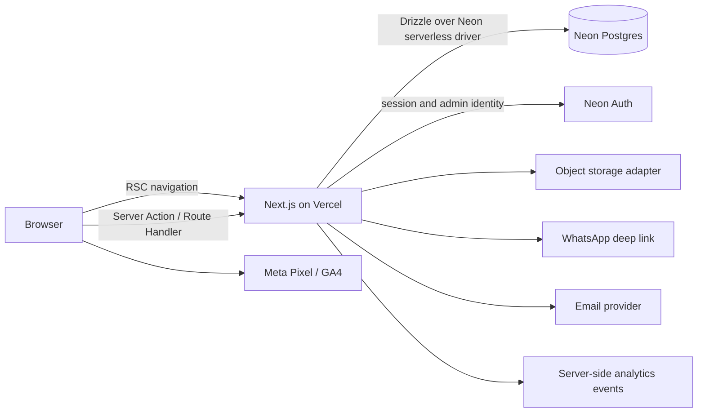
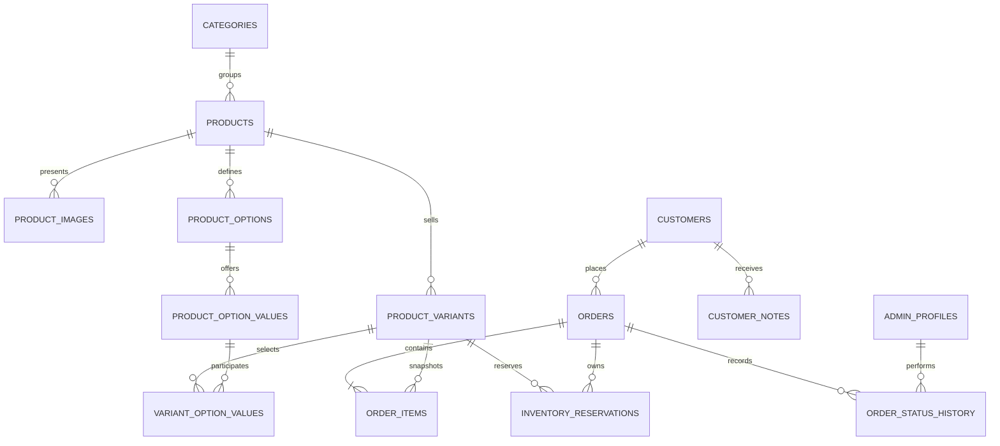

# Peakfit Architecture

## System shape

Peakfit is a Next.js App Router application deployed to Vercel. React Server Components load public catalog data; Server Actions and Route Handlers own mutations. Neon provides serverless Postgres and Neon Auth. Product media is accessed through a storage adapter so the final object-storage provider can change without rewriting catalog or admin features.



## Module boundaries

```text
src/
  app/                    route composition, metadata, route handlers
  components/ui/          canonical shared primitives
  components/store/       reusable storefront composition
  features/catalog/       products, categories, variants, merchandising
  features/cart/          client cart state and server validation
  features/checkout/      COD form, shipping, idempotent order submission
  features/orders/        lifecycle, admin operations, history
  features/admin/         protected workspace composition
  lib/auth/               Neon Auth client/server adapters
  lib/config/             validated runtime configuration
  lib/db/                 Neon connection and Drizzle schema
  lib/storage/            product-media provider port and adapters
  lib/analytics/          consent-aware client/server event adapters
  lib/i18n/               locale, currency, direction, message adapters
drizzle/                  versioned SQL migrations and metadata
tests/
  unit/                   domain and component contracts
  e2e/                    conversion and admin journeys
```

Route components depend on features; features depend on domain contracts and infrastructure adapters. Domain code does not import UI, Neon, or storage clients. Prices are integer centimes and all order line values are immutable snapshots.

## Data model



Flexible options avoid hardcoded sizes or colors. A product may define `Taille`, `Couleur`, `Longueur`, or a future option; each variant combines option values and owns SKU, price override, stock, reserved quantity, weight, and active state.

## Inventory policy

1. COD submission runs one database transaction that locks requested variants, revalidates active product/variant prices, computes shipping from server settings, creates snapshots, and increments `reserved_quantity`.
2. A reservation expires after a configurable window (default 24 hours) while the order is `NEW` or `CONTACTED`.
3. Moving to `CONFIRMED` converts reserved units into committed stock reduction and closes the reservation.
4. Cancellation before commitment releases reserved units. A post-confirmation cancellation may restock only through an explicit audited admin action.
5. Scheduled cleanup releases expired reservations idempotently. Availability equals `stock_quantity - reserved_quantity`.

## Order lifecycle

Allowed forward path:

```text
NEW -> CONTACTED -> CONFIRMED -> PREPARING -> SHIPPED -> DELIVERED
```

Exceptions:

- `NEW`, `CONTACTED`, or `CONFIRMED` may move to `CANCELLED` under the inventory rules above.
- `SHIPPED` may move to `REFUSED`; stock return is a separate audited receipt decision.
- `DELIVERED` may move to `RETURNED`; refund and restock flags are explicit even while COD is the only payment method.
- Every change appends status history with actor, timestamp, optional reason, and before/after values.

## Authentication and security

- Public shopping is guest-first and does not require an account.
- Admins authenticate through Neon Auth. Neon Auth identity maps to `admin_profiles`, which stores role and active state.
- Server layouts verify the session; mutations verify capabilities and use a restricted application database role. Browser code never connects directly to Postgres.
- Public catalog reads flow through server components or cacheable route handlers. Customer, order, note, reservation, and setting records are never exposed through public database credentials.
- Order submission is server-only. `DATABASE_URL` and all administrative credentials stay server-side.
- Media uploads validate type, signature, dimensions, and size on both client and server. Storage paths use generated IDs, never customer input.
- Secrets, phone numbers, addresses, tokens, and full checkout payloads are excluded from logs and client analytics.

## Analytics contract

Client events: `view_item_list`, `select_item`, `view_item`, `add_to_cart`, `remove_from_cart`, `view_cart`, `begin_checkout`, and `purchase_submitted`. Server events: `order_confirmed`, `order_shipped`, `order_delivered`, `order_cancelled`, `order_refused`, and `order_returned`.

`purchase_submitted` is a funnel event, not revenue. Revenue dashboards use delivered order totals. First- and last-touch UTM values plus landing page and referrer are snapshotted onto the order.

## Deployment

- Vercel: Next.js hosting, preview deployments, environment separation, and a scheduled reservation cleanup route.
- Neon: one primary production database with isolated branches for previews and migrations. Production schema changes run only from versioned Drizzle migrations.
- Required environment groups: Neon pooled and direct database URLs, Neon Auth URL/cookie secret, site URL, media storage, WhatsApp number, email provider, analytics IDs, and cleanup secret.
- Preview environments must never use production secrets or send customer notifications.

## Architecture decisions

- Next.js App Router over a static prototype because checkout, inventory, admin auth, server price validation, and SEO are core requirements.
- Neon serverless Postgres with Drizzle for typed schema, SQL migrations, and transaction control.
- Neon Auth for admin identity so authentication branches with database environments.
- Server-first catalog rendering for performance and indexability.
- Normalized product options with immutable order snapshots for catalog flexibility and historical accuracy.
- Pessimistic order/inventory mutations and idempotency keys for COD duplicate protection.
- Archive products instead of routine hard-delete; retain historical order snapshots and status history.
